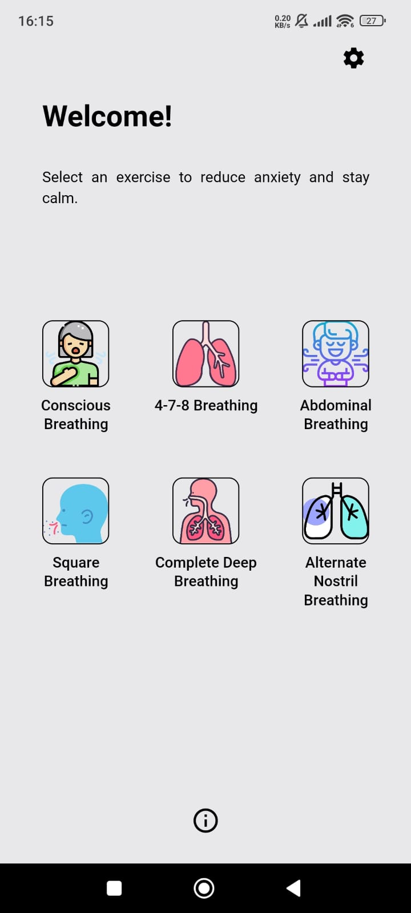

<br/>
<br/>


# BREATHAPP

Hello, welcome, this is BREATHAPP, an app designed to help people manage anxiety through breathing techniques. It is important to note that this application does not replace professional guidance from a doctor or therapist. Always consult a healthcare professional for proper assessment and advice. ❤️


## Overview

BREATHAPP contains some breathing techniques that help reduce anxiety or regain focus if you want to use it for this reason, it also has some timer aids and counters so you can control the cycles

## Installation

To install, just clone the project and install the dependencies and run

1. Download the source code or clone this repository.
2. Navigate to the project directory.
3. Run the installation command:

```bash
# Example installation command
npm install
yarn install

# Example usage command
npm start
```

## Features

- Breathing Guides: Step by step of different breathing techniques.
- Breath timer and counter: Set and follow a personalized breathing rhythm or cycles.
- Dark mode: Switch the theme according to your preference.

<br/>

<div style="display: flex; justify-content: space-between;">
   
   
   
   
   
</div>

## Contributing

- Fork the repository.
- Create a new branch: `git checkout -b feature/new-functionality`.
- Make your changes and submit a pull request.


### Notice
BREATHAPP does not replace professional medical consultation. Always consult a healthcare professional for personalized guidance.


## License
_This project is licensed under the MIT License._

